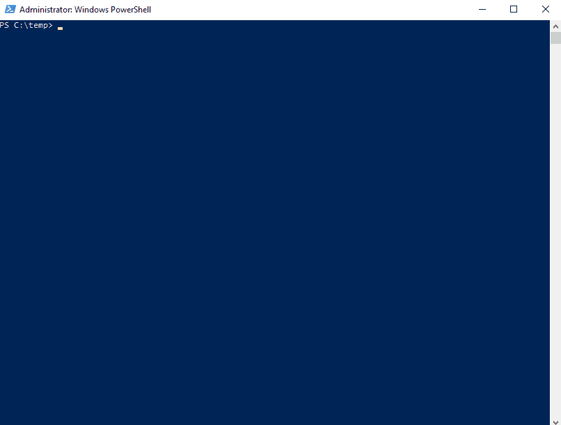

# PowerLsassSilentProcessExit

PowerShell script to dump lsass.exe process memory to disk for credentials extraction via silent process exit mechanism.

## Description

The script causes WerFault.exe to dump lsass.exe process memory to disk for credentials extraction via silent process exit mechanism without crasing lsass.exe. This technique is adapted from: https://github.com/deepinstinct/LsassSilentProcessExit

## Parameters

### DumpMode

- 0 - Call RtlSilentProcessExit on LSASS process handle
- 1 - Call CreateRemoteThread with RtlSilentProcessExit on LSASS

### DumpPath
- Path where the dumpfile shall be stored

## Demo

The following demo shows the dumping:



## Known Issue

At the time of writing, we could not get the DumpMode 1 (using CreateRemoteThread) to work.

The powershell.exe process gets dumped along with lsass using the DumpMode 0, hence any pointers to get the other method working is welcome!

## Monitoring Guidance

The [original article](https://www.deepinstinct.com/2021/02/16/lsass-memory-dumps-are-stealthier-than-ever-before-part-2/) provides some pointers on how to detect this technique. From our point of view, the following two techniques are best to detect our script being run:

### Monitoring Registry

Monitor the following keys for creation and modification:

```
HKEY_LOCAL_MACHINE\SOFTWARE\Microsoft\Windows NT\CurrentVersion\Image File Execution Options\lsass.exe
HKEY_LOCAL_MACHINE\SOFTWARE\Microsoft\Windows NT\CurrentVersion\SilentProcessExit\lsass.exe
```

### Monitoring PowerShell

The following article is a good resource: https://devblogs.microsoft.com/powershell/powershell-the-blue-team/

## Authors

- Ville Koch ([Twitter](https://twitter.com/vegvisir87))
- Sylvain Heiniger ([Twitter](https://twitter.com/sploutchy))
